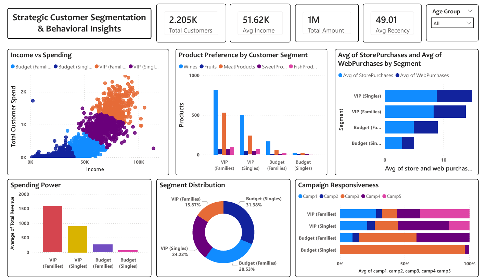

# Customer Segmentation Analysis

## 📌 Project Overview
This project analyzes iFood customer data using PCA and K-Means clustering to identify high-value segments. By profiling customers based on spending habits and demographics, it provides data-driven marketing strategies to improve campaign ROI. Includes a complete Python analytical pipeline and an interactive Power BI dashboard for tracking KPIs.

## 🛠️ Tools Used
* **Python:** Data cleaning, feature engineering, and advanced analytics.
* **Scikit-Learn:** Implementation of `StandardScaler`, `PCA`, and `K-Means` clustering.
* **Matplotlib & Seaborn:** Exploratory Data Analysis (EDA) and cluster visualization.
* **Power BI:** Dynamic dashboarding for stakeholder reporting and KPI tracking.

## 📊 Key Insights & Recommendations

| Category | Key Insight | Strategic Recommendation |
| :--- | :--- | :--- |
| **High-Margin Drivers** | Wine and Meat are the primary revenue anchors across all profitable segments. VIP groups spend over 60% of their budget here. Usually, a wine buyer is also a meat buyer. | Bundle them up. Place premium meats near the wine section in stores. Online, show a "People also bought this steak with this wine" pop-up to increase the total bill. |
| **High-Value Demographic Profile** | "Seniors" and "Elderly" customers spend the most per trip. Younger shoppers visit often but buy cheaper items. | Target the quality seekers. Use ads that talk about "premium quality" and "tradition" for older customers. For younger shoppers, try to increase their spend by offering "Premium Starter Kits" or small luxury treats. |
| **Channel Dominance** | Top-tier (VIP) customers like to see and touch fresh products. They browse your website to see what’s available but prefer to go to the physical store to buy. | Use the app to send "In-Store Only" invitations, like a free wine tasting or a "VIP-only" hour. This turns digital browsing into actual physical sales. |
| **Campaign Efficiency & Response** | Many customers hate "cheap" generic discounts. They responded much better to Campaign 4 than to Campaign 2. | Choose "Special" over "Cheap." Stop offering 10% off to everyone. Instead, give your VIPs "First Choice" on new products or "Limited Edition" items. People spend more when they feel they are getting something exclusive. |

## 🖼️ Dashboard Preview

## 📂 Project Structure
* `task2.ipynb`: Python file
* `ifood_df.csv`: Source dataset
* `task2.pbix`: Power BI Report
* `customer_segmentation.png`: Screenshot of dashboard

## ⚙️ How to Run
1.  **Python Environment:** Open `task2.ipynb` in Jupyter Notebook or VS Code and run all cells to perform the clustering.
2.  **Dataset:** Ensure `ifood_df.csv` is in the same directory as the notebook.
3.  **Power BI:** Open `task2.pbix` to explore the interactive visualizations. If the data doesn't load, click **Transform Data** and update the source path to your local `segmented_customers.csv`.
